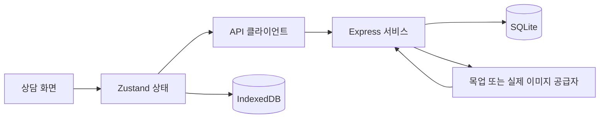

# Hair Twin

미용사와 고객이 헤어스타일 후보를 함께 보고, 원하는 부분을 조정한 뒤 상담 결과를 기록하는 태블릿용 웹 앱입니다. 고객의 앞·옆·뒤 사진과 상담 조건을 바탕으로 후보를 비교하고, 이미지 버전별 변경 이력을 보관합니다.

React 프론트엔드와 Express 백엔드로 구성되어 있으며 데이터는 SQLite에 저장합니다. **기본 개발 모드는 목업 로그인과 목업 AI입니다. API 키 없이 상담·생성·편집·저장 흐름을 확인할 수 있습니다.** 실제 AI 호출 코드는 구현되어 있지만, 키 연결과 실제 모델의 이미지 품질 검증은 아직 진행하지 않았습니다.

## 문서

| 문서 | 내용 |
| --- | --- |
| [작업 정리](WORK_LOG.md) | 온보딩부터 AI 구현까지의 변경 사항, 검증 결과, 남은 작업 |
| [AI 파이프라인](AI_PIPELINE.md) | 생성·편집 입력, 다각도 참조, 마스크, 버전 저장과 API 계약 |
| [백엔드 안내](server/README.md) | 서버 설정, API 목록, SQLite 및 인증 동작 |
| [실패 원인 로그](server/README.md#실패-원인-로그) | 오류 ID로 브라우저·서버 실패 연결, AI 단계별 원인 확인 |

## 주요 기능

- 고객 관리, 상담 기록 조회, 매장별 스타일 프리셋 관리
- PNG·JPEG·WebP 사진 선택과 모바일 촬영 입력, 세 방향 사진의 PNG 정규화
- 상담 의도·모발 특성·길이·옆머리 상태·프리셋을 포함한 생성 요청
- 후보 A·B·C의 개별 생성과 각 후보의 앞·옆·뒤 이미지 비교
- 선택 영역의 마스크 편집, 편집된 기준 이미지를 활용한 다른 방향 갱신
- 반환 이미지의 버전 저장, 과거 버전 선택 및 해당 버전에서 재편집
- 선택 버전의 상담 기록 저장, 기록 상세에서 후보·버전 이력 조회
- IndexedDB를 통한 진행 중인 상담 복원과 대시보드의 상담 이어가기

## 개발 시작

### 요구 환경

- Node.js 22.13 이상: 백엔드에서 내장 `node:sqlite`를 사용합니다.
- npm, Git
- 검증한 로컬 환경: Windows PowerShell, Node.js 22.17.1, npm 10.9.2

별도 DB 서버 설치는 필요하지 않습니다. 아래 명령은 프로젝트 루트에서 실행합니다. PowerShell 실행 정책과의 충돌을 피하기 위해 `npm.cmd`를 사용합니다.

```powershell
npm.cmd ci
npm.cmd --prefix server ci
if (!(Test-Path .env)) { Copy-Item .env.example .env }
if (!(Test-Path server/.env)) { Copy-Item server/.env.example server/.env }
```

터미널 두 개를 열고 각각 실행합니다.

```powershell
# 터미널 1: 백엔드
npm.cmd --prefix server run dev
```

```powershell
# 터미널 2: 프론트엔드
npm.cmd run dev
```

| 주소 | 용도 |
| --- | --- |
| <http://localhost:5173> | 앱 화면 |
| <http://localhost:8787/api/health> | 백엔드 상태 확인 |
| <http://localhost:5173/api/health> | Vite의 API 프록시 확인 |

`지수 디자이너`로 로그인하면 기본 고객 2명과 프리셋 1개를 확인할 수 있습니다. `SEED_DEMO=true`일 때 서버가 시작하면서 데모 데이터를 준비합니다. 각 터미널에서 `Ctrl+C`를 누르면 개발 서버가 종료됩니다.

### API 키 없이 체험하기

1. 로그인하고 새 고객 상담을 시작합니다.
2. 고객 이름과 상담 의도를 입력합니다.
3. 앞·옆·뒤 사진을 선택하거나, 개발 모드의 **연습용 사진 사용**을 누릅니다.
4. 스타일과 모발 조건을 정하고 후보 3개를 생성합니다.
5. 후보를 선택한 뒤 영역·길이·피드백을 조정하고 적용합니다.
6. V1·V2를 비교하고 최종 버전을 선택해 상담 기록을 저장합니다.
7. 대시보드에서 기록을 열어 후보와 버전 이력을 확인합니다.

목업 AI는 입력 사진의 PNG 픽셀을 변형해 흐름을 검증합니다. 실제 헤어스타일 합성 결과를 제공하는 모드는 아닙니다. AI 생성·편집과 서버 버전 저장에는 백엔드 연결 및 로그인이 필요합니다.

## 설정

| 파일 | 변수 | 기본값 / 역할 |
| --- | --- | --- |
| `.env` | `VITE_MOCK_AI` | `true`: 연습용 사진·화면 샘플 제공 |
| `.env` | `VITE_API_URL` | 미설정 시 `/api`; 개발 중 Vite가 백엔드로 전달 |
| `server/.env` | `PORT` | `8787` |
| `server/.env` | `AUTH_PROVIDER` | `mock`: 이름으로 로그인 |
| `server/.env` | `AI_PROVIDER` | `mock`: 키 없는 이미지 흐름 검증 |
| `server/.env` | `DB_PATH` | `./data/hairtwin.sqlite`: 서버 작업 디렉터리 기준 |
| `server/.env` | `SEED_DEMO` | `true`: 시작 시 데모 데이터 준비 |
| `server/.env` | `OPENAI_IMAGE_MODEL` | `gpt-image-1`: 실제 공급자의 모델 설정 |
| `server/.env` | `OPENAI_API_KEY` | 실제 공급자에 필요한 서버 전용 키 |

AI 공급자는 **서버의 `AI_PROVIDER`**로 선택합니다. `VITE_MOCK_AI`는 서버 공급자를 전환하지 않습니다. 서버 실행 스크립트는 `server/.env`를 읽습니다.

실제 AI를 사용할 때는 서버에 `AI_PROVIDER=real`과 키를 설정합니다. 키가 없거나 외부 API가 실패하면 오류를 반환하며 목업 결과로 자동 대체하지 않습니다. 현재 작업에서는 사용자 요청에 따라 API 키 생성·연결을 생략했습니다.

현재 프론트 로그인은 이름만 전송합니다. `AUTH_PROVIDER=real`의 비밀번호 인증을 사용하려면 로그인 화면과 클라이언트를 추가로 확장해야 합니다. 운영 환경의 인증·JWT 설정은 [백엔드 안내](server/README.md)를 참고하세요.

## 프로젝트 구조

```text
src/
  main.tsx / App.tsx       앱 진입점, 라우팅, 로그인 보호
  pages/core.tsx          로그인, 대시보드, 고객, 기록, 프리셋
  pages/flow1.tsx         상담 시작 → 의도·사진·스타일·모발 상태 → 생성
  pages/flow2.tsx         후보 → 피드백·비교 → 확정·리포트
  components/            공용 UI와 이미지 뷰어·조정 도구
  stores/                Zustand 상태와 서버 동기화
  api/                   API 클라이언트와 AI 요청
  storage/               IndexedDB 저장 어댑터
  utils/photos.ts        사진 파일 검증 및 PNG 정규화
  mocks/                 연습용 SVG 이미지
  types.ts / data.ts      도메인 타입과 화면용 데이터
server/
  src/routes/            API 경로와 Zod 입력 검증
  src/controllers/       요청·응답 처리
  src/services/          인증·고객·프리셋·기록·AI 로직
  src/repositories/      SQLite 조회와 저장
  src/db/                스키마 마이그레이션과 데모 데이터
  src/providers/image/   목업·실제 공급자, 프롬프트, PNG 마스크
  src/middleware/        JWT 인증, 검증, 오류 처리
  test/                  API 및 이미지 공급자 회귀 테스트
  data/                  로컬 SQLite DB (Git 제외)
AI_PIPELINE.md            AI 구현 상세
WORK_LOG.md               작업 내역과 검증 결과
vite.config.ts            개발 포트와 API 프록시
```

기술 구성은 React 18, TypeScript, Vite 5, Tailwind CSS, Zustand, Express 4, Zod, JWT, Node SQLite, pngjs입니다. 두 패키지는 각각의 `package-lock.json`을 기준으로 설치합니다.

### 데이터와 AI 흐름



실제 공급자는 후보마다 정면을 먼저 생성하고, 그 결과를 해당 후보의 측면·후면 참조로 사용합니다. 편집은 저장된 기준 버전에 마스크를 적용하고, 편집 결과를 다른 두 방향의 참조로 사용합니다. 다각도 일관성은 이미지 참조와 프롬프트로 유도하며, 3D 재구성이나 자동 품질 검증을 수행하지 않습니다.

서버에는 원본 입력, 후보와 반환 이미지 버전을 저장합니다. 인증·프리셋 상태는 localStorage에, 사진이 포함된 상담 초안과 고객·기록 캐시는 IndexedDB에 보관합니다. 상세 입력과 저장 규칙은 [AI 파이프라인](AI_PIPELINE.md)에 정리되어 있습니다.

## 검증과 빌드

프로젝트 루트에서 실행합니다.

```powershell
npm.cmd run build
npm.cmd --prefix server run typecheck
npm.cmd --prefix server run build
npm.cmd --prefix server test
```

2026-10-05 기준 프론트·백엔드 빌드와 회귀 테스트 13개가 통과했습니다. 브라우저에서는 사진 입력, 새로고침 복원, 후보 생성, 마스크 편집, V1·V2 비교, 상담 저장 및 기록 이력 조회를 목업 모드로 확인했습니다. 검증 범위는 [작업 정리](WORK_LOG.md#검증-결과)를 참고하세요.

| 명령 | 결과 / 용도 |
| --- | --- |
| `npm.cmd run build` | 프론트 타입 검사와 빌드, `dist/` 생성 |
| `npm.cmd run preview` | 빌드한 프론트 미리보기; 개발 API 프록시는 제공하지 않음 |
| `npm.cmd --prefix server run build` | 백엔드 빌드, `server/dist/` 생성 |
| `npm.cmd --prefix server run serve` | 빌드한 백엔드 실행 |
| `npm.cmd --prefix server test` | 임시 SQLite와 가짜 HTTP 응답을 이용한 테스트 |

프론트 미리보기나 별도 호스팅에서는 `VITE_API_URL` 또는 서버의 `/api` 프록시를 별도로 설정해야 합니다. 별도 lint 스크립트와 프론트 자동 테스트 스크립트는 없습니다. Node SQLite의 ExperimentalWarning이 표시될 수 있습니다.

## 개발 시 확인할 사항

- 화면은 `src/pages/`, 공통 UI는 `src/components/`에서 수정합니다.
- 생성·편집 계약을 바꾸면 공유 타입, Zod 스키마, API 클라이언트, 공급자와 관련 테스트를 함께 확인합니다.
- DB 변경은 `server/src/db/database.ts`의 마이그레이션에 추가합니다. 기존 DB를 삭제해 적용하지 않습니다.
- `.env`, DB, 설치 캐시, 빌드 결과물은 Git에서 제외합니다. API 키는 프론트 환경변수에 넣지 않습니다.
- 실제 모델의 이미지 품질, 인증 화면 확장, 운영용 이미지 저장소·보존 정책, 배포 설정은 남은 작업입니다.

원본 저장소: [jecool0523/hairtwin-jang](https://github.com/jecool0523/hairtwin-jang)
